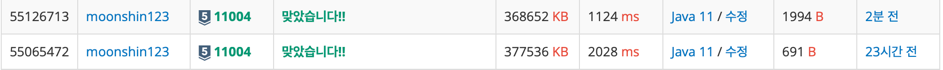

# K번째 수 - 11994

[문제링크](https://www.acmicpc.net/problem/11004)

## 성능 요약
quick 정렬 - Memory: 368,652KB, Time: 1,124ms

Arrays.sort() - Memory: 377,536KB, Time: 2,028ms

## 문제 설명
수 N개 A1, A2, ..., AN이 주어진다. A를 오름차순 정렬했을 때, 앞에서부터 K번째 있는 수를 구하는 프로그램을 작성하시오.

## 입력
첫째 줄에 N(1 ≤ N ≤ 5,000,000)과 K (1 ≤ K ≤ N)이 주어진다.

둘째에는 A1, A2, ..., AN이 주어진다. (-109 ≤ Ai ≤ 109)

## 출력
A를 정렬했을 때, 앞에서부터 K번째 있는 수를 출력한다.

## Arrays.sort() vs quick 정렬

코드길이 691B가 Arrays.sort() 메서드를 활용해서 푼 정답

코드길이 1994B가 quick 정렬을 이용한 정답 풀이

사진에서 보이는것처럼 quick 정렬을 이용해서 푼 정답이 시간에서 약 2배가량 차이가 남